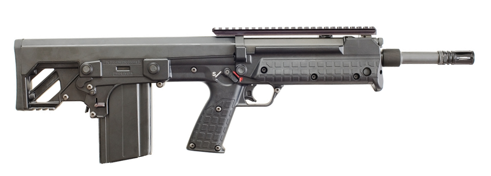
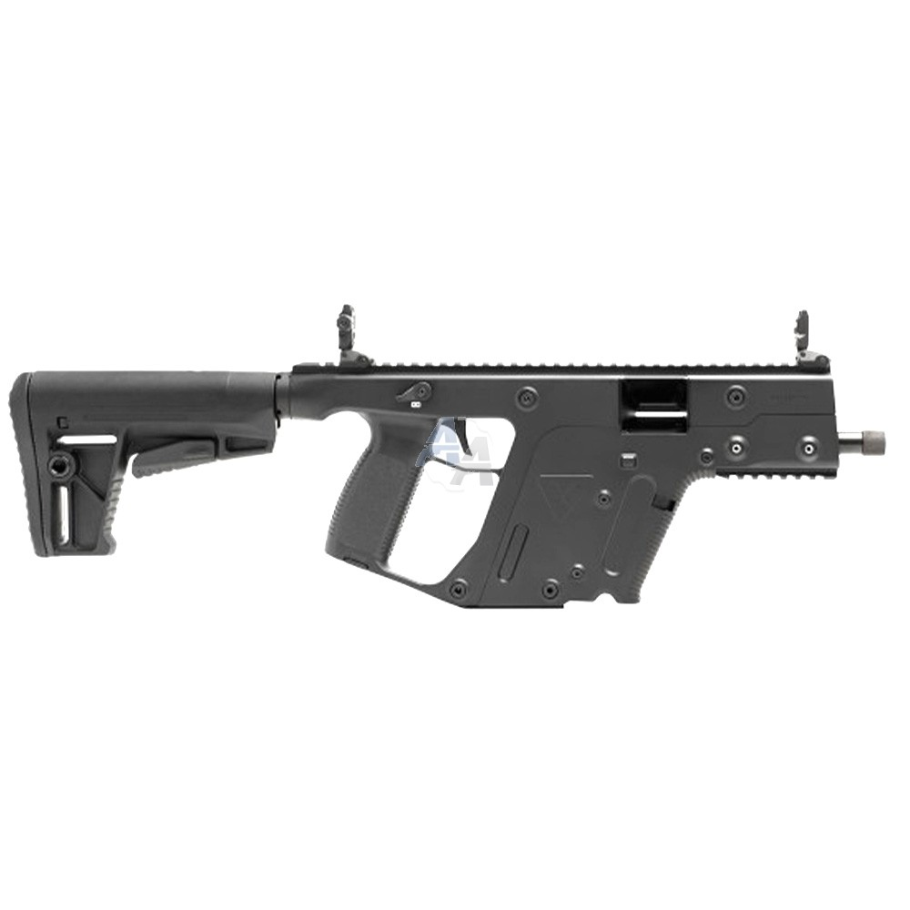
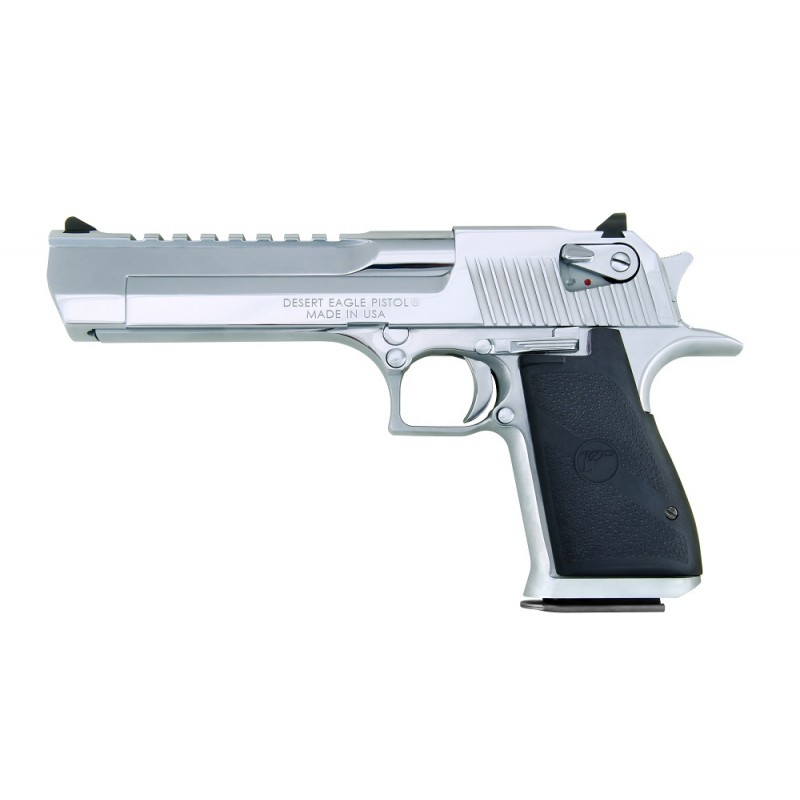
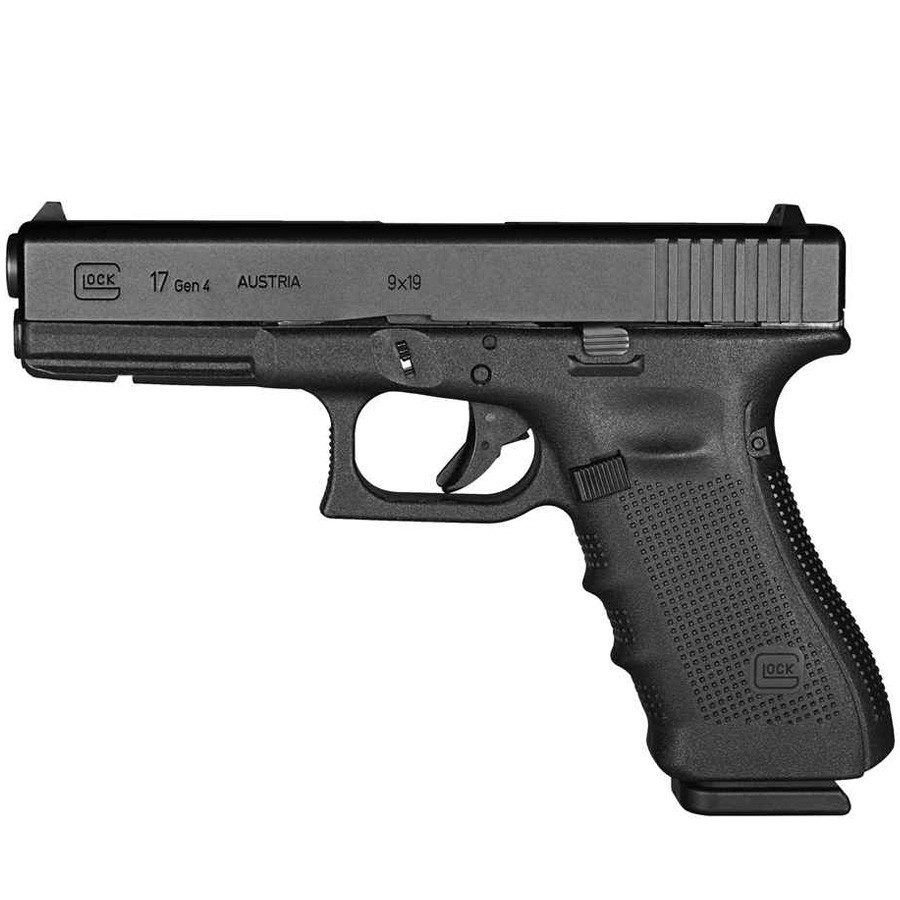
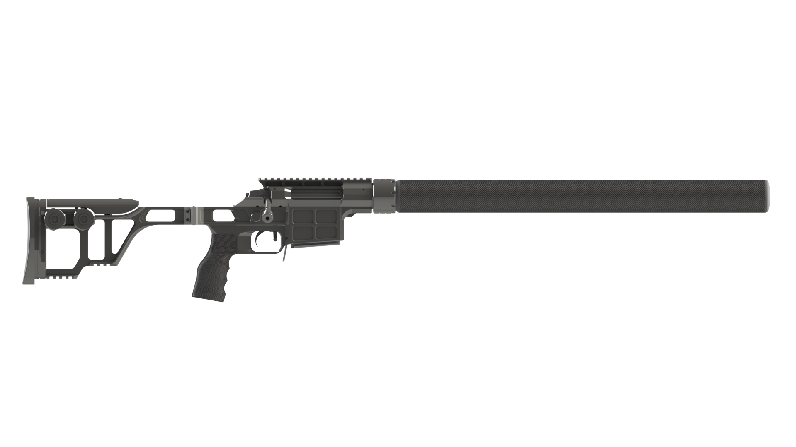

# Multi Agent Debate
Multi Agent Simulation of a Simple Firearm Debate using Mesa

## Table of Contents
- [**Example**](#example)
- [**Implementation**](#implementation)
  - [**Preferences**](#preferences)
  - [**Dataset**](#dataset)
  - [**Messaging**](#messaging)
  - [**Arguments**](#arguments)
- [**Usage**](#usage)


## Example

In this simulation, two agents argue about which infantry weapon to choose for a reconaissance mission.

Here, agent A proposes a random firearm (Kel-Tec RFB) and justifies his choice because of the semi-automatic fire rate.

<p align="center">
  
</p>

```
Step 0:
Message from A: PROPOSE
Kel-Tec RFB ()

Step 1:
Message from B: ASK_WHY
Kel-Tec RFB ()

Message from A: ARGUE
Because
Kel-Tec RFB ()
Argument : FIRE_RATE = 7
```

Then both agents argue and find a weapon with a very high automatic fire rate (the Kriss Vector)

<p align="center">
  
</p>

```
Step 2:
Message from B: ARGUE
Found better item for this criterion
Desert Tech MDR ()
Argument : FIRE_RATE = 8

Message from A: ARGUE
Found better item for this criterion
Kriss Vector ()
Argument : FIRE_RATE = 10
```

Then, agent B argues that for a reconaissance mission, fire rate is less important than mobility as being able to move quickly allows to cover more ground. He proposes a Desert Eagle because of its light weight.

<p align="center">
  
</p>

```
Step 3:
Message from B: ARGUE
The criterion is not the most important one
Desert Eagle ()
Argument : MOBILITY = 9
```

Agent A finds an even lighter alternative: the Glock 17 with its polymer frame.

<p align="center">
  
</p>

```
Message from A: ARGUE
Found better item for this criterion
Glock 17 ()
Argument : MOBILITY = 10
```

Finally, Agent B argues that mobility is less important than range as being able to engage targets from a distance plays a big part in reconaissance. He proposes the bolt-action Lobaev Arms DVL-10 rifle which both agents accept as their favorite.

<p align="center">
  
</p>

```
Step 4:
Message from B: ARGUE
The criterion is not the most important one
Lobaev Arms DVL-10 ()
Argument : RANGE = 10

Message from A: ACCEPT
Lobaev Arms DVL-10 ()

Step 5:
Message from B: COMMIT
Lobaev Arms DVL-10 ()

Message from A: COMMIT
Lobaev Arms DVL-10 ()

Commitment reached for Lobaev Arms DVL-10 () !
```

## Implementation

Both agents share the same knowledge base (preferences and database).

### Preferences

The preferences are based on the needs of a reconaissance task and are sorted from most important to least:
- **Stopping Power**: the ability to neutralize threats in few shots
- **Range**: the ability to hit distant targets accurately
- **Mobility**: the ability to move while carrying the weapon
- **Fire Rate**: the number of rounds per unit of time the weapon can fire
- **Capacity**: the amount of rounds carried per magazine
- **Price**: the price of the weapon, its ammunition and maintenance

### Dataset

The database is contained in the `weapons_dataset.csv` file and is as follows (criterias are evaluated on a scale of 1 to 10, 10 being better):

| WEAPON             | STOPPING_POWER | FIRE_RATE | RANGE | CAPACITY | MOBILITY | PRICE |
| ------------------ | -------------- | --------- | ----- | -------- | -------- | ----- |
| Glock 17           | 4              | 3         | 2     | 5        | 10       | 10    |
| Daniel Defense M4  | 8              | 7         | 6     | 8        | 6        | 3     |
| Mossberg 870       | 9              | 2         | 3     | 3        | 7        | 7     |
| Remington M700     | 9              | 2         | 10    | 1        | 6        | 9     |
| Staccato 2011      | 4              | 4         | 2     | 6        | 10       | 3     |
| Benelli M4         | 9              | 3         | 3     | 1        | 7        | 5     |
| Saiga AK-74        | 8              | 6         | 6     | 8        | 6        | 7     |
| Desert Tech MDR    | 8              | 8         | 7     | 8        | 5        | 2     |
| Lobaev Arms DVL-10 | 9              | 2         | 10    | 1        | 7        | 4     |
| Kel-Tec RFB        | 8              | 7         | 7     | 8        | 5        | 4     |
| Remington SASS     | 9              | 3         | 9     | 7        | 2        | 1     |
| RPG-7V2            | 10             | 1         | 4     | 1        | 1        | 2     |
| HK MP5             | 4              | 9         | 3     | 8        | 8        | 4     |
| Kriss Vector       | 4              | 10        | 3     | 8        | 8        | 2     |
| Desert Eagle       | 6              | 2         | 2     | 3        | 9        | 4     |
| FN Minimi          | 8              | 5         | 5     | 10       | 3        | 3     |

### Messaging

Each agent is capable of sending and receiving messages.

At each step of the simulation, the agents read their messages and send responses. The simulation starts with an agent proposing a random weapon with a supporting argument

Generally, the agent will receive a proposition with an argument. He then agrees or counter-proposes:
- The agent agrees if the weapon proposed is a top 10% solution meaning that the sum of the values of the weapons weighted according to the preferences is in the top 10%
- Otherwise he proposes another weapon with a counter-argument


### Arguments

When an agent receives an unsatisfying proposal ("I want this weapon because it has this value at this criteria"), he does the following:
- If he finds a weapon with a better value for the proposed criteria, he proposes this new weapon
- If not, if he finds a criteria more important, he chooses that criteria and proposes a better weapon considering the new criteria
- If not, that means that even though the weapon has good stats, its overall score is unsatisfying. He proposes a random weapon with a supporting argument.

## Usage

1. Clone the repository:
   
```
git clone https://github.com/AlexandreSajus/Multi-Agent-Debate.git
```

2. Install requirements:

```
pip install -r requirements.txt
```

3. Run `run.py`

This should print out a conversation:

```
Step 0:
Message from A: PROPOSE
Desert Eagle ()

Step 1:
Message from B: ASK_WHY
Desert Eagle ()

Message from A: ARGUE
Because
Desert Eagle ()
Argument : STOPPING_POWER = 6

Step 2:
Message from B: ARGUE
Found better item for this criterion
Lobaev Arms DVL-10 ()
Argument : STOPPING_POWER = 9

Message from A: ACCEPT
Lobaev Arms DVL-10 ()

Step 3:
Message from B: COMMIT
Lobaev Arms DVL-10 ()

Message from A: COMMIT
Lobaev Arms DVL-10 ()

Commitment reached for Lobaev Arms DVL-10 () !
```